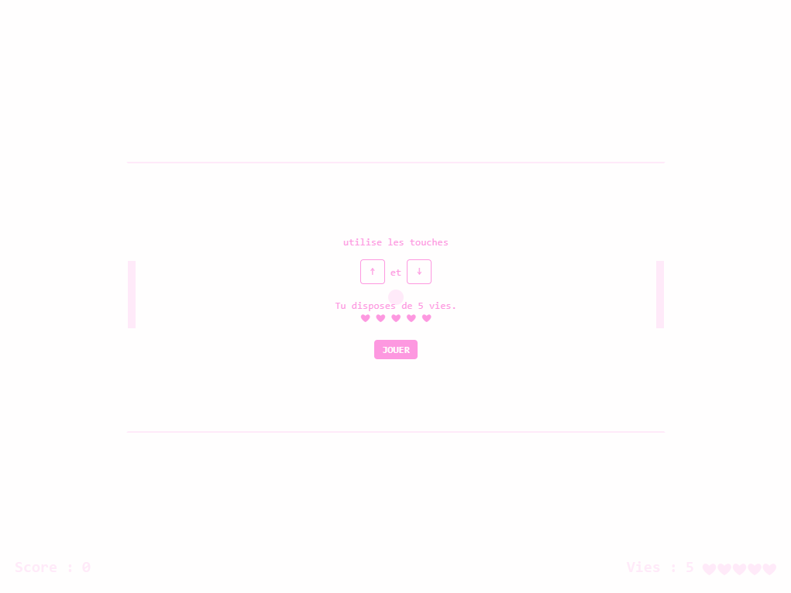
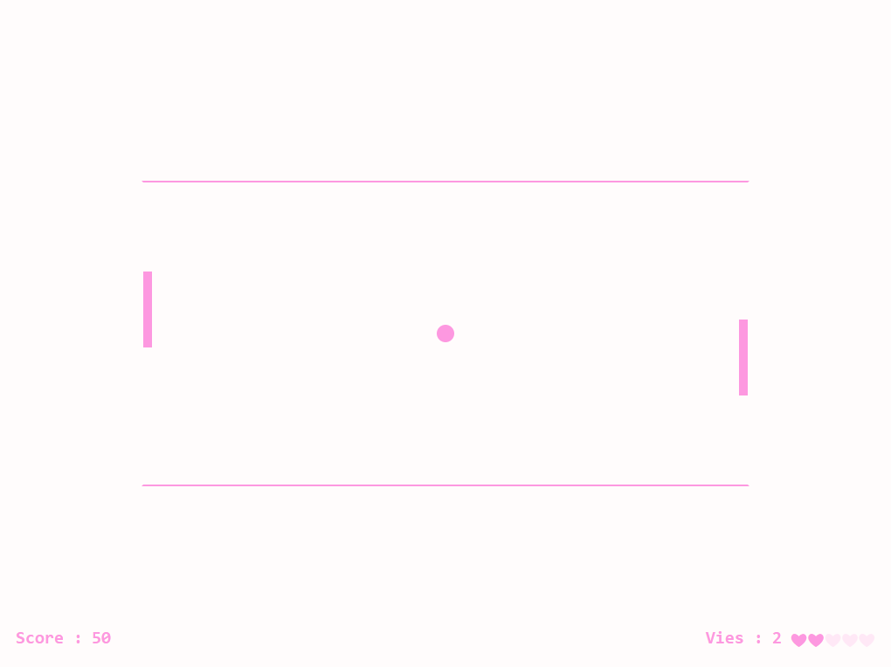
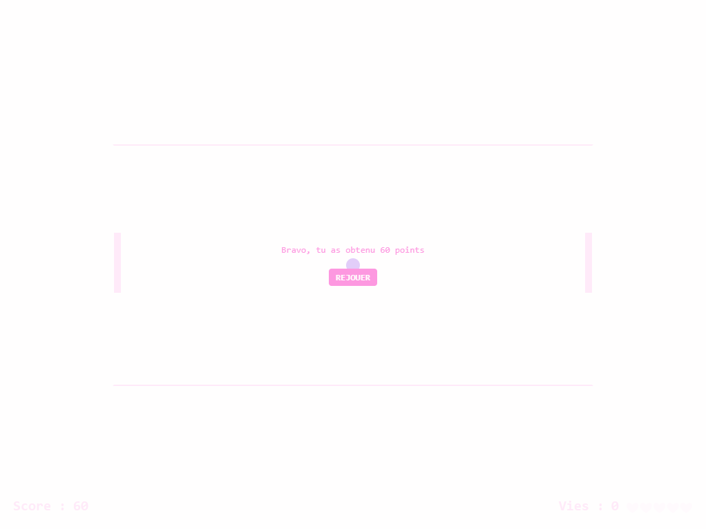

# Un Pong Monoplayer
Votre partiel du 14/12/2020

-----------

Un petit aperçu de ce que j'attends [est visible ici](https://drive.google.com/file/d/1ypgUYziRdZlav33MX-wfUyRSb4CpwXQm/view?usp=sharing).

L'objectif est bien d'**avoir un jeu jouable**. Si vous n'arrivez pas à afficher des petits coeurs pour les vies par exemple ce n'est pas très grave. Allez à l'essentiel et gérez bien votre temps.

## Pour commencer

Créez un nouveau repo nommé `pong-monoplayer` sur votre github.

- initialisez votre repo avec un readme.md
- dans les settings activez github pages
- mettez dans votre readme le lien vers votre site ainsi créé... et vérifiez que ce lien marche!

Bref...faites la même chose que les autres fois :)

Vous pouvez partir de votre pong comme point de départ, [partir de mon code](https://github.com/davidmars/pong-jquery) ou repartir de zéro si vous êtes dingos, c’est comme vous le sentez.

### Pour qui est fait ce jeu?
Une petite fille de 8 ans qui s’ennuie dans sa chambre.

- On reste minimal dans le graphisme (car ce n’est pas l’objet du partiel) mais gardez en tête que les petites filles de 8 ans adorent le rose sous toutes ses formes :\
- Le niveau de difficulté est facile, celui d’une petite fille de 8 ans qui ne joue pas beaucoup. 
- La balle ne va donc pas accélérer très vite.

## Screen de départ
Faire un écran de départ qui ressemble à ça :

## Fonctionnement du Jeu

#### Contrôles asymétriques

- La joueuse en appuyant sur la touche flèche haut du clavier fait bouger la raquette gauche vers le haut et la raquette droite vers le bas

- La joueuse en appuyant sur la touche flèche bas du clavier fait bouger la raquette gauche vers le bas et la raquette droite vers le haut.

*Si vous ne parvenez pas à faire fonctionner le jeu avec les flèches du clavier, vous pouvez les remplacer par les touches H et B (sous entendu haut / bas)*

#### Accélération
La balle accélère un peu à chaque toucher de raquette.

#### Points
Chaque fois que la joueuse touche la balle, elle gagne 10 points.

#### Vies
Quand la joueuse rate la balle, elle perd une vie. 

### Screen de fin

Quand la joueuse a perdu ses 5 vies, on lui dit...

Le bouton rejouer permet de refaire une partie, 

- la balle repart au centre
- le score est remis à zéro
- la vitesse réinitialisée
- la joueuse a de nouveau 5 vies.

## Bonus pour votre note

#### Qualité de code

- Il n’y a pas de fichiers inutiles
- Il n’y a pas de variables inutiles.
- Il n’y a pas de fonctions inutiles.
- Il n’y a pas de CSS ou HTML inutiles.
- Les classes sont dans des fichiers séparés, nommés correctement.

#### Pour frimer un peu

- Quand la balle touche une raquette, lui donner un effet graphique (changement de couleur, rebond, bordures… comme vous le sentez mais n’y passez pas une heure)

#### Pour frimer beaucoup

- Utiliser switch case quelque part  (m’indiquer où c’est dans votre README dans le code)
- Toutes les variables et toutes les méthodes sont commentées selon la norme jsdoc.
- En bas du pong afficher des commentaires aléatoires en fonction de ce qui se passe dans le jeu (Bien joué, pas mal, dommage, perdu, super, bravo…)

